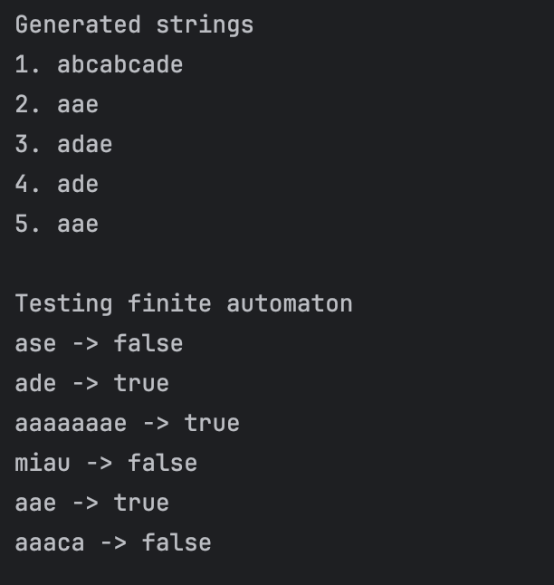

# Laboratory Work 1

### Course: Formal Languages & Finite Automata
### Author: Gabriela Bîtca FAF-242

----

## Theory
A formal language is a set of strings formed from a finite alphabet according to specific rules. Unlike natural languages, formal languages have precise definitions suitable for mathematical analysis and computation.
A formal grammar consists of non-terminal symbols, terminal symbols, a start symbol, and production rules. Grammars generate strings by starting from the start symbol and applying production rules until only terminals remain.
A finite automaton recognizes strings by processing input symbols through state transitions. It accepts a string if it ends in a final state after consuming all input. Regular grammars can be directly converted to finite automata, establishing equivalence between generative and recognitive approaches.


## Objectives:

* Discover what a language is and what it needs to have to be considered a formal one;
* Provide the initial setup for the evolving project; 
* According to the variant number, get the grammar definition and do the following <br>
    a. Implement a type/class for your grammar; <br>
    b. Add one function that would generate 5 valid strings from the language expressed by your given grammar; <br>
    c. Implement some functionality that would convert an object of type Grammar to one of type Finite Automaton; <br>
    d. For the Finite Automaton, please add a method that checks if an input string can be obtained via the state transition from it.
## Variant 8:
```VN={S, D, E, J},
    VT={a, b, c, d, e},
    P={
    S → aD
    D → dE
    D → bJ
    J → cS
    E → e
    E → aE
    D → aE
    }
```
## Implementation description
§
The Grammar class stores all the components of my grammar: the non-terminals {S, D, E, J}, the terminals {a, b, c, d, e}, the start symbol "S", and the production rules. I used a HashMap to store the productions so that each non-terminal can quickly access its list of rules. This makes the structure clean and easy to manage.
```java
public Grammar() {
    nonTerminals = new HashSet<>(Arrays.asList("S", "D", "E", "J"));
    terminals = new HashSet<>(Arrays.asList("a", "b", "c", "d", "e"));
    startSymbol = "S";
    productions = new HashMap<>();
    productions.put("S", Arrays.asList("aD"));
    productions.put("D", Arrays.asList("dE", "bJ", "aE"));
    productions.put("J", Arrays.asList("cS"));
    productions.put("E", Arrays.asList("e", "aE"));
}
```
The generateString() method starts from the start symbol S and randomly chooses production rules. Each time, it adds the terminal symbol to the result and continues with the next non-terminal (if there is one). It keeps going until it reaches a rule that contains only a terminal.

At first, I was worried about infinite loops because of the rule E -> aE, but since there is also E -> e, the derivation eventually stops. So the generation works correctly and produces valid strings from the language.
```java
public String generateString() {
    String current = startSymbol;
    StringBuilder result = new StringBuilder();
    while (nonTerminals.contains(current)) {
        List<String> rules = productions.get(current);
        String rule = rules.get(random.nextInt(rules.size()));
        result.append(rule.charAt(0));
        if (rule.length() == 2) {
            current = String.valueOf(rule.charAt(1));
        } else {
            break;
        }
    }
    return result.toString();
}
```
For the conversion to a Finite Automaton, I followed the standard algorithm for right-linear grammars. Each non-terminal becomes a state. If a production is of the form A -> aB, I create a transition from state A to state B with symbol a.

If a production is of the form A -> a, that means the word ends there, so I created a new final state "F" and added a transition to it. This makes the automaton accept the string correctly.

Everything worked as expected after carefully building the transition structure. The only thing I had to pay attention to was correctly initializing the transitions map before adding transitions, otherwise it could cause errors.
```java
public FiniteAutomaton toFiniteAutomaton() {
    Set<String> states = new HashSet<>(nonTerminals);
    states.add("F");
    Map<String, Map<String, Set<String>>> transitions = new HashMap<>();
    for (String state : productions.keySet()) {
        for (String rule : productions.get(state)) {
            String symbol = String.valueOf(rule.charAt(0));
            String nextState = (rule.length() == 2) ? 
                String.valueOf(rule.charAt(1)) : "F";
            transitions.get(state).get(symbol).add(nextState);
        }
    }
    return new FiniteAutomaton(states, terminals, transitions, 
        startSymbol, new HashSet<>(Arrays.asList("F")));
}
```

The automaton tracks all possible current states, processes each input character by computing reachable next states, and accepts if any final state is reached.
Strings like "ade" and "aae" are accepted because they follow valid derivation paths (S -> aD -> ade, S -> aD -> aE -> aae), while invalid strings are correctly rejected. The grammar-to-automaton conversion preserves the language definition, confirming the equivalence between the two representations.
## Conclusions
<div align="center">
  
  <p>Figure 1 - Output results</p>
</div>

This laboratory work successfully implemented the core concepts of formal language theory. The Grammar class generates valid strings through random application of production rules, while the FiniteAutomaton class recognizes whether strings belong to the language. The conversion between these two representations preserves the language definition, confirming their theoretical equivalence.
